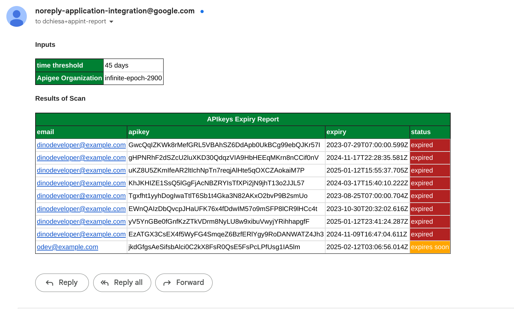

# An Integration for Apigee Credential Expiry Checking

This is an Integration that runs on a schedule to check Developer App Credentials in Apigee
organizations, to see if any are "expired" or will be expiring "soon".

This integration runs in an automated fashion.
It sends an email after collecting results. The default schedule is nightly.

The email looks like this:

<!--  -->


Please note: this integration, in its current form, does not send an individual
email out to each developer with an expired or soon-to-expire API key.  That
would be an easy modification, but it doesn't do that in it's current form.

## Disclaimer

This example is not an official Google product, nor is it part of an
official Google product.

## Pre-requisites

- a bash-like shell.

- the gcloud cli, installed and available on your path.

- standard unix utilities like grep, sed, and tr

- You must be signed in (`gcloud auth login`) to an account that
  has access to each of the apigee projects you want to scan.  The setup script
  will create a Service account in the App Integration project, and grant rights
  to that SA, as apigee.readOnlyAdmin on the Apigee projects.  So your user must
  have the ability to run `gcloud projects add-iam-policy-binding PROJECT ...`
  on those Apigee projects.

## On Permissions

There are Google IAM permissions required to perform the various setup steps.
These are:

  - in the Integration project, permission to create a service account. This may
    require `roles/iam.serviceAccountAdmin` role.

  - also in the Integration project, permission to grant _yourself_
    `iam.serviceAccountUser` role on that service account. Again, this may
    require you to have `roles/iam.serviceAccountAdmin` role in those projects.

  - in each of the Apigee projects you wish to scan, the permission to grant
    `apigee.readOnlyAdmin` role to the service account in _that other project_.
    Your user must have `setIamPolicy` permissions in the Apigee projects you
    want to scan. This may require you to have `roles/iam.serviceAccountAdmin`
    role in those projects.

In the above you saw this phrase repeatedly: "may require role X".  The roles
described there will be sufficient, but if you are "Owner" or "Editor" in all of
the various projects, then you have all the required permissions.

It might be the case that a single person does not have all the permissions
required. In that case you cannot use the automated setup script.  You will need
to manually perform the setup, collaborating with different people who have the
right permissions in the various projects.

## Setup

Modify the env.sh file to set variables suitable for your scenario.

You can set:
- `APPINT_PROJECT` - the project ID that will run the Integration. It must have integration already enabled.

- `REGION` - the region to use for the integration in your project.

- `EXAMPLE_NAME` - the name of the integration that will get created in your project.

- `APIGEE_PROJECTS` - a comma-separated list of project IDs (no spaces)

- `EMAIL_ADDR`- the email address that will get the report.

- `SCHEDULE` - This specifies the schedule on which the integration will
   run. The default value of the `SCHEDULE` variable set in env.sh is "17 21 * *
   *"; this means the integration is set to execute on a schedule, nightly at
   21:17. You can modify this by using a different schedule. Use a
   crontab-compliant schedule specification.  Try
   [crontab.guru](https://crontab.guru/) to generate a spec, to set into the
   env.sh file.

Save the file.

Then, source that script, and run the setup script.

```sh
source ./env.sh
./setup-apikey-expiry-checker.sh
```

This takes just a few minutes.

If the setup completes successfully, it will finish by invoking the integration.
You should see some JSON output showing the status of that - in the happy case, output
variables of the integration.

Check the email inbox for the email address you specified in the environment
settings for the report.

At the end of the script output, you should see a link to the cloud console page
that will allow you to view the integration.


## Invoke the Integration

The Integration will run on a schedule.  If you would like to run it
pro-actively, _right now_, use the following script to invoke the trigger
from the command line:

```sh
./test-invoke-integration.sh
```

## Modifying the Integration

After the setup script succeeds, you will be able to modify and tweak the
integration interactively, using the Cloud Console UI. To do that, open the link
the script displayed in a browser. Use the TEST button, and specify the Schedule
trigger.

### Changing the set of Projects to check

If you want to run it against a _different_ set of Apigee projects than that
specified in the env.sh file, one option is start all over: to run the clean up
script, modify env.sh, source it again, and re-run the setup.

But there is an easier way to add a new prject: just enable the existing service
account with apigee.readOnlyAdmin role, on the new project or projects. There's
a script that can do _just that_:

```sh
./add-apigee-project.sh project-id-of-additional-apigee-org
```

Then you can use the Cloud Console UI to re-run the TEST with the Schedule
trigger, specifying the newly-added project.

### Changing anything else

To change anything other than the set of Apigee projects to check, in an automated fashion,
you must start over. To do so, follow these steps:

1. run the clean up script
   ```sh
   source ./env.sh
   ./clean-apikey-expiry-checker.sh
   ```

2. modify env.sh

3. source the modified env.sh script, and then re-run the setup.
   ```sh
   source ./env.sh
   ./setup-apikey-expiry-checker.sh
   ```


## Teardown

The cleanup script will remove everything the setup script had set up.

```sh
source ./env.sh
./clean-apikey-expiry-checker.sh
```


## Support

This example is open-source software, and is not a supported part of Google Cloud.  If
you need assistance, you can try inquiring on [the Google Cloud Community forum
dedicated to Application Integration](https://goo.gle/appint-community) There is no service-level
guarantee for responses to inquiries posted to that site.

## License

This material is [Copyright 2024-2025 Google LLC](./NOTICE).
and is licensed under the [Apache 2.0 License](LICENSE). This includes the setup code
as well as the Integration configuration.

## Bugs

* This README does not document the precise steps people must follow for manual
  setup, which is necessary in the case in which a single person does not have
  all the required permissions.

